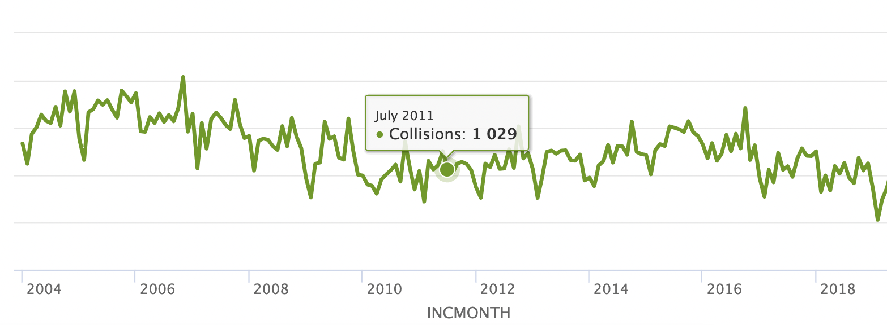
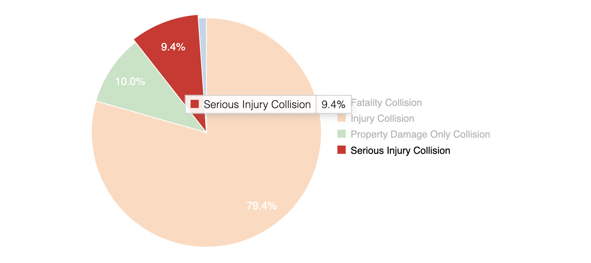
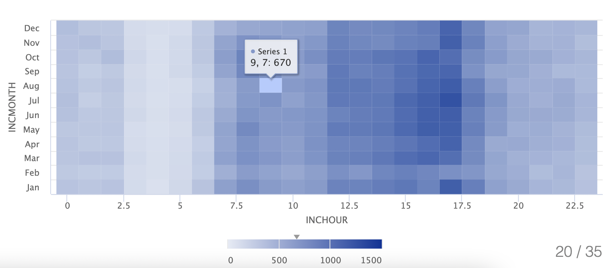
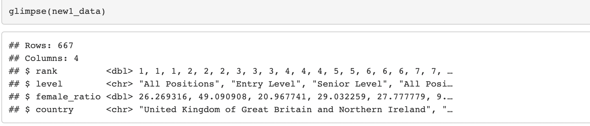
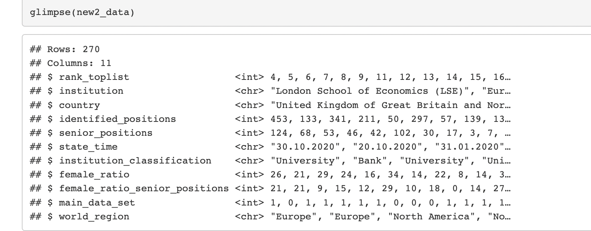
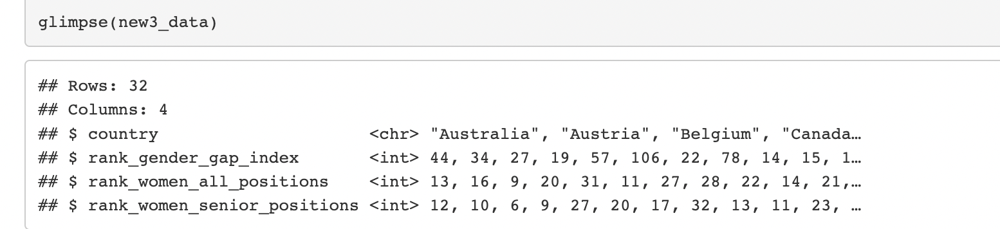
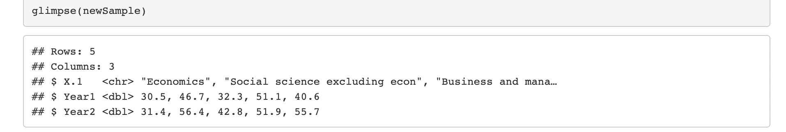
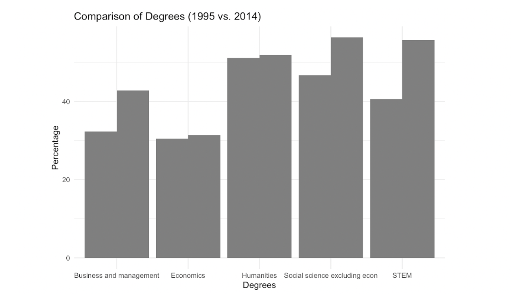
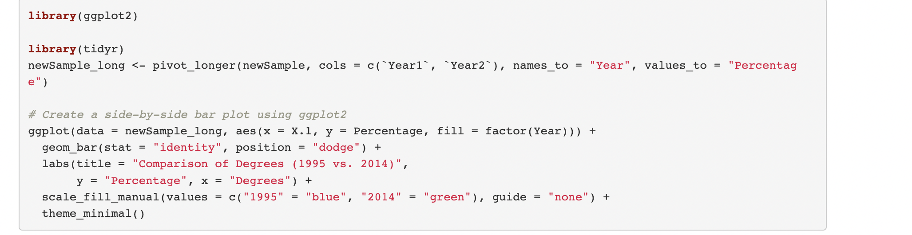

```{r setup, include=FALSE}
knitr::opts_chunk$set(echo = TRUE)
```

### Week-9

#### Data Story Topic

The topic that I have chosen is **Sockonomics Unveiled**:This investigation explores the impact of missing socks in U.S. laundry between 2000-2019 on household finances, shedding light on how this seemingly trivial, unrelated and very bizarre issue can affect both current income and allocation of future expenses of households in the U.S. We evaluate the decrease in current income and change in allocation of future expenses.

#### Data Sources curated so far

1- The data sources curated so far are from Kaggle on personal expenditures in the U.S. by State from 1997-2019- <https://www.kaggle.com/code/davidbroberts/us-personal-expenditures-1997-2019>. There is also a data source from Data.gov which provides data on expenditures, income and demographic characteristics of consumers in the U.S. It provides it in different forms which I have accessed from here- <https://catalog.data.gov/dataset/consumer-expenditure-survey-dbf32> . These will tell me how much of income on average of a typical household in U.S. is allocated to clothing.

2- The third data source is Statista from where I have accessed Average annual expenditure on laundry and cleaning supplies per consumer unit in the United States from 2007 to 2022 <https://www.statista.com/statistics/305499/us-expenditure-on-laundry-and-cleaning-supplies/>.

3- To see the percentage of socks within the apparel expenditure, I have accessed- <https://www.statista.com/topics/965/apparel-market-in-the-us/#topicOverview> from Statista on the different categories of expenditure that make up the U.S. Apparel Market.

### Week-10

#### Title-

Sockonomics Unveiled- how do lost socks from U.S. laundry shape American household finances?

#### Why is it important-

In accordance to one report by Bureau of Labor Statistics, Americans spent \$198 per annum on average, on socks and hosiery in 2019. This highlights a financial burden that lost socks may pose on families. For a thriving economy, the financial stability of households is a crucial component. The phenomenon of the missing socks may seem inconsequential, but when we extrapolate across all households(millions in US), it represents a substantial economic loss.

Secondly, by the emphasis on sustainable development goals (UNEP, 2020) missing socks encapsulates a broader consumer behavior and wastefulness. We have to understand the economic impact in order to stress on the seriousness of the matter on wastefulness. This knowledge is important for more efficient household spending habits which are also sustainable. The World Economic Forum (WEF) in 2016 has shown that "seemingly small, everyday choices made by consumers can collectively have a substantial impact on resource use and waste generation."

Lastly, the allocation of future expenses depends to a large extent on purchasing decisions made today. Missing socks lead to increased sock purchases in the future as replacement. In the context of economic theory, seemingly trivial factors can have ripple effects throughout the economy. Behavioral economics research, cited by the World Bank, indicates that "present decisions can indeed have far-reaching effects on future expenses, often referred to as the"spillover effect" or "decision cascades""(World Bank, 2015). Hence, in the larger context of household financial planning, studying the economic impact of missing socks is significant. According to the behavioural economist Thaler in 1999,"presence of"friction" in decision-making processes, can influence consumer choices and have broader economic consequence."

#### Specific Columns/Variables

Here is a survey that was conducted- This is the dataset- <https://gwern.net/doc/psychology/2019-01-21-eric-socksurvey.csv> These were the survey questions. The data is based on a survey done with an international audience of sample size n=455. It was conducted on a personalized quiz website. For this dataset, I will be using the question (2), (3) relevant to my data story- (2) QN will be used to estimate how many socks will be washed per week. There is a correlation between number of socks owned and number of socks used. Hence, number of socks used will then be correlated to number of socks washed per week.

(3)QN will be used to find out future expenses on replacement socks. We will see the frequency of missing socks and then, take into account the frequency of the replacement through this survey and find out future expenditure on replacement socks.

Hence, column "Count" and "Frequency" will be used.

Do you have enough pairs of socks? Yes/No

How many pairs of socks do you have? (Numeric)

How often do you buy replacement socks? Monthly Semi-annually Annually Less or never

Who buys your socks? Me Spouse/significant-other Relative Other

Once we take this, we will use the sock loss formula to estimate sock losses in a week -

The Sock Loss Formula given by Samsung-

Sock loss index = (L+C)-(P x A)

Higher the value, the more likely you will lose socks. We will use an adapted version of the formula, and keep everything else constant (using standard value) except number of socks washed in a week: Prob= 0.38+(0.005 x L)+(0.0012 x C)-(0.0159 x P x A)3

Where:

L = Laundry size Calculated by multiplying the number of people in the household (p) with the frequency of washes in a week (f). (here f will be taken at average, p will be taken yearly from this dataset- <https://usafacts.org/data/topics/people-society/population-and-demographics/population-data/average-family-size/> the column will be "Average number of people in a family")

C = Washing complexity Calculated by adding how many types of wash (t) households do in a week (darks + whites) and multiplying that by the number of socks washed in a week (s) (here t will be held constant and s will be estimated from the above dataset as mentioned)

P = The positivity towards doing laundry Measured on a scale of 1 to 5 with 1 being 'Strongly dislike doing clothes washing' to 5 which represents 'Strongly enjoy doing clothes washing' (we will take this at average)

A = Degree of Attention Which is the sum how many of these things you do at the start of each wash check pockets, unroll sleeves, turn clothes the right way and unrolling socks"

We will take this information, use the sock loss formula, to find out the number of missing socks by year (since we take the number of people in a household by year), then use the single average price of all types of socks in US from the CPI (generalise it to all years to control for price) and again use the average number of people in a household in US (yearly as above in dataset) to get an estimate of the lost current expenditure in that particular year on missing socks. To find future expenditure on replacement socks, we do the same thing, except also take into account the frequency of replacement socks from the first dataset (qn 3), to find the future expenditure arising from these replacement socks, with each particular year as the reference year for future expenditure from that year onwards.

<https://www.kaggle.com/code/davidbroberts/us-personal-expenditures-1997-2019> We then use the column of "Clothing and footwear" from the above dataset to find out the percentage of expenses in missing socks as part of clothing and footwear in years from 1997-2019 and also, as percentage of total expenditure.

## Challenges and Errors:

The main challenge in this investigation to find relevant accurate data from surveys conducted. Collecting data on missing socks and their financial or economic impact is challenging. It is difficult to distinguish the direct impact of missing socks from other factors affecting household finances and amongst laundry-related variables like the types of wash, or the positivity towards wash. We are taking these as constant to avoid confusion. We also have to make estimations or take an average number in order to provide a clear pathway of cause-effect of only lost socks on current and future expenditure and no other variable. We make an estimation of the number of socks washed per week from the number of socks owned and take averages like the average price of all types of socks from CPI- Consumer Price Index.

Furthermore, the dataset used does not specifically include a column for "missing socks." Therefore, it is necessary to use proxy variables or devise a methodology to estimate the financial effect which we did through the sock loss formula.

To ensure the accuracy of results, we need to account for potential errors, such as missing or partial data in the surveys, and we extrapolate the survey information of an international audience into the average price of socks, average number of people in a household in US, the average total expenditure, we have to make an assumption to get a constant average number. We also have to figure out a way to take into account, from missing socks, the frequency of replacement socks in order to find an estimate of future expenditure.

## Week-11

### Changes from past diary entries-

After a thorough research on finding datasets and data sources for Sockonomics Unveiled, unfortunately, I wasn't able to find detailed datasets, meaning- the datasets I found were either about clothing and apparel and the expenditure on them, and not separate data on socks which is too narrow to find. The dataset on socks based on a survey I found had little information on "missing" socks. The most relevant variables were about the number of socks people have and the frequency of replacement. If I use these variables, to find out the number of socks that go missing in laundry on average in a week, I will have to make a lot of estimations based on the sock loss formula that has been established. Many variables there are not available and we can make estimations or assumptions on the variables, but making so many such estimations does not help with the idea of data exploration and visualization on the topic. The data available is too narrow and less to be able to explore or visualize. The sock loss formula has been calculated by Samsung based on a survey on laundry and socks they conducted- but the survey data has not been made publicly available. That was the biggest drawback and forced me to make many estimations about laundry cycles, laundry size, washing complexity, etc. Hence, the estimations and the variables I chose in the last week's diary entry and the exploration I did was valid but due to so many estimations, it becomes very narrow a topic.

### This is a new topic I wish to work on-

#### Finding the right dog for you: Congrats! You're a pawfect match!

Under this topic, I will delve into the evolving popularity of dog breeds and names over a ten-year period from 2007 to 2017, specifically focusing on data from the United States between 2007 and 2017. The primary objective is to gain valuable insights into the preferences of dog owners during this decade and unravel the dynamics of dog breeds and names for people to make their preferred choice before adopting a dog.

### Importance of the Project:

*Cultural and Societal Insights:* Understanding the changing preferences in dog breeds and names provides essential cultural insights and societal preferences- as societies evolve, so do their preferences, and these preferences reflect broader cultural shifts. Analyzing dog ownership trends can serve as a mirror to societal changes in values, lifestyle choices, and economic factors (maybe the popularity was based on price of raising?).

*Companion Animals' Role:* Dogs have consistently held a unique place in human society as companion animals- they are a man's best friend. Their popularity and the choices made in selecting a particular breed or name can provide insights into the evolving roles of dogs in households. Say, if a german shepherd is being adopted more, maybe the household prioritises safety by choosing a guard dog.These choices can reflect how dogs transition from working animals to beloved family members, influencing our choices and responsibilities towards them.

*Responsible Pet Ownership:* The United Nations, through various agencies like the Food and Agriculture Organization (FAO), emphasizes responsible pet ownership. Studying the popularity of dog breeds and names can highlight trends in pet ownership, which can be related to issues like breed-specific legislation, pet health, and animal welfare. It can promote responsible choices regarding dog breeds and emphasize the importance of providing the best care for pets. Many times because of an imperfect (or impawfect) match, dog owners in the US reduce their care on pet health and often times, even give their dogs up for adoption. The importance of finding a perfect match goes beyond aesthetics and comfort, but on compatibility to avoid disappointing results later since dogs develop symptoms of attachment and disattachment veru frequently.

*Implications for the Pet Industry:* Changes in dog breed and name preferences can have far-reaching implications for the pet industry. From dog food and grooming products to pet accessories and services, the industry relies on understanding consumer preferences. Analyzing these preferences can help pet-related businesses tailor their offerings to meet the evolving demands of dog owners. This is much more relevant nowadays with even student entrepreneurs even at NUS, working on pet products.

*Global Perspectives on Pets:* The United Nations recognizes the importance of pets and animals in achieving the Sustainable Development Goals (SDGs), such as promoting well-being and responsible consumption. By studying dog ownership trends in the United States, this project can contribute to a broader understanding of global pet ownership dynamics and their impact on sustainability and human well-being.

The datasets I have found are specific to US from 2007 to 2017. I will be taking two years to show how the popularity changed over a decade.

We will be focusing on dog breeds and dog names.

Starting with the 2017 dataset-

I'll be using the variables of "Color", "Breed", "DogName"- with this I will be assessing the popular breed, popular color and the number of dogs with names starting with a particular letter.

I will also be using a combination of the variables "Color" and "Breed" in the sense of the AND binary operator to find out which color and breed combinations are most popular.

I will be doing the same for the 2007 dataset- and the visualizations will show the changes over a decade in the US.

To go deeper, I will also be assessing the variable "LicenseType". This will help to show preferences for dogs more clearly.

### Visualizations to be used-

For Data Visualizations- 
1) Popular dog breeds over time- I will be depicting the change from 2007 to 2017 using a line chart and also adding a trendline. Here, it is useful for me to use the datasets for years in between 2007 to 2017 to better depict the time series change. This will be a bit complex since there are different datasets. (I will have to create a new dataset from the existing ones.) But, I will be taking the top 10 breeds of 2017 (latest year available to me) and then assessing the popularity of those breeds in different years from 2007 to 2017. I will be having the "year" on the x-axis and the "Breed" on the y-axis. There would be separate lines for the different breeds and hence, we can clearly compare the trend. (categoric variable)
2) Popular dog colors- I will create two pie charts to display the distribution of dog colors in 2007 and 2017 to see shifts in color preferences. (categoric variable)
3) Color and Breed Combinations- I will use a heatmap to represent the frequency of different color and breed combinations. This will help me identify the most popular color-breed combinations.For this maybe, subpanels through facets can be used. (categoric variable)

Layers of ggplot2 like labels, aesthetic mappings like colour- colour will be utilised to distinguish between different trendlines (colour in visualization 1). I can integrate these graphs in shiny app to actually show these changes by different years- the year will be chosen in the sliderinput. To do this, I can maybe change the graph where the slider input will adjust it by the width of year- number of bins but it would show by divisions of 1 year, 3 years, or 5 years. When the pointer hovers over any point on the trendlines, the exact number can be shown alongwith the year as well. It can be something like this- 

```{r, out.height= "400px",out.width= "800px",echo=TRUE,eval=TRUE,fig.cap="Insert caption here"}

```

Pie chart can be made interactive by adding a brief description when the pointer hovers to the piece of pie- the description can be specific to dog breeds within that colour. 

```{r, out.height= "400px",out.width= "800px",echo=TRUE,eval=TRUE,fig.cap="Insert caption here"}

```

Even the heatmap can be made interactive as such using Shiny- 

```{r, out.height= "400px",out.width= "800px",echo=TRUE,eval=TRUE,fig.cap="Insert caption here"}

```


I wish to use Shiny to make a complete interactive dashboard which includes popularity on all aspects of colour, breed, License Type, name, so that users can choose any filter or adjust any filter they like and see the frequency of dogs according to that filter. I would also like to use Shiny for a whole comparative analysis between 2007 and 2017.

I would use the sidebar panel to put in the filters there uaing sliderinput- of names of breeds, colours from cold to warm, types. If difficult, I would choose top 10 breeds or top 10 license types to narrow down filters. it will be a difficult undertaking so hopefully, with narrowing down, it will be a bit easier. 

### Concepts-

1)  Choice of right visualization and using ggplot to create the line chart, adding trendlines for separate breeds, pie charts, heatmap - Week-7
2)  Using the shiny app and customizing of the sidebar panel for the filters, adjusting of the slider input for the different values or names of breeds, type, colours, etc. All changes to the user interface and also, adding 3 dog images, using and learning from all examples- Week-8
3)  Integration of Shiny dashboard with Quarto- Week-8
4)  Adding a new tab or page to Quarto Website - Self-taught
5)  Choosing a custom template on website for image and text with a divider like on my "Home" tab for the web page- Self-taught
6)  Adding icons embedded with links on quarto website- Self-taught
7) Adding a flowchart which can be customised in any way on Quarto wesbite for summary- this will be an important summary aspect for my webpage- Self-taught
8) Making a heatmap- Self taught
9) Making a pie chart- self taught
10) Making a line chart with different lines for different breeds- Self-taught

### Challenges faced

-   The challenge that I faced mostly was with the integration of shiny app on quarto website. The errors were confusing. For now, I have integrated it. I was able to load the project again and the iframe tag started working since I specified it was html or block in the brackets after the ticks like \`\`\`{block}. After that, I am still getting an error due to python. I installed it and jupyter as well, but am not able to figure out where it is being used. Hence, for now, I have added proof of integration along with the basic placeholders/framework for the visualizations and write up.

-   I needed to change my topic and it was challenging to assess if data is sufficient or not. I had to take the decision since data was too narrow. Hence, I had to redo the importance of the project, etc and find relevant datasets again.

-  It is difficult to find a way to combine different datasets together. I had to create a new csv file for the top 10 breeds of the years from 2007-2017 so that I have a timeseries graph showing the changes in popularity from 2007-2017. 

- It was difficult to learn how interactivity can be brought about- I searched for different graphs which were interactive so that I could have an idea of the possible ways to make it interactive- not in terms of how to do it but what features can be added. I have also added these graphs- this is the source- 
Yollin, B. (n.d.). Interactive charts in shiny. https://byollin.github.io/RInteractiveCharts/#20 

- It is difficult to combine the columns of colour and breed to take both into account together in the heatmap. For that, a new column must be created of colour plus breed and can be shown along years. What we can also do to fix this challenge, is take colour on one axis and breed on another axis on the heatmap- choosing a heatmap helps solve the problem to a large extent instead of getting complex with data. 


## Week-12

### Topic- 
After talking to the tutor and Professor, in order to make the topic more challenging to work with for more challenging scope and effort, I changed my topic to study the glass ceiling and leaky pipeline phenomenon. The datasets for the previous topic were clean and straightforward- I was able to use all the variables in 2-3 graphs and hence, I had either the option of adding more datasets for prediction or choosing a new topic. The topic of dog breed and colour popularity that I was working on had much less scope for any type of prediction and interactivity and even if there did exist scope, it was not very interesting topic to explore for the user or the viewer. Hence, I chose a more interesting as well as informative topic. My modified topic is as follows-  The glass ceiling and leaky pipeline: Let’s talk about the gender inequality in the workforce. 

The glass ceiling is a phenomenon that describes the existence of artificial barriers that slow down the growth of women in the workforce. These factors can be inherent such as the will for women to value personal life more than professional life with age, emotional inclination of women, or the social (gender-biased) conditioning such as the need to tend to domestic duties. They can also be external such as the gender pay gap, inequality in the workforce in terms of opportunities or the gender-biased discriminatory attitude of superiors towards their juniors in the field. 

The leaky pipeline is a phenomenon that explains why women disappear as they move up the ranks in their respective fields like a leaky pipeline. There are less number of women at the higher ranks of different fields. 

 I will be examining this question and phenomenon in the United States. I was able to find datasets for the country because the required survey has been conducted there for economics. I wish to explore the phenomenon for the field of economics. Although this type of gender gap/inequality exists for other fields as well, the inequality is much stronger for economics than in other social sciences. Hence, out of social sciences, I chose economics. The reason why I did not choose any field outside of social sciences such as STEM is because most researchers at current do realize that women are underrepresented in STEM fields and thus, required measures are starting to be put in place. There is very slow growth for the same in economics and researchers and the general public at large are not aware of the gap in economics and how slow the change is taking place. The gender gap in economics also indicates some general bias in science since economics unlike other social sciences requires and relies heavily on analytical skills and mathematics and statistics. 

It is important to note this gender gap because it is not only for women in the field who endure sexist policies and hostile behaviour but even government policies would be different if more women were involved in the committees who formulated them. Some famous economists even mentioned that “economics is the worst field to be a woman in.”  

Hence, the field is mostly dominated by men in terms of faculty members in universities or positions in banks, etc, relative to the overall population and relative to other disciplines. 
Why is this topic important (alongwith evidence statistics):- 


Economic Growth Potential:

According to a report by McKinsey & Company, advancing women's equality and reducing the gender gap in the workplace could add $12 trillion to global GDP by 2025. There is a lot of potential in women who are getting educated and shifting to the workfield- it is important to recognize and utilize the potential to add to the labor productivity in the economy. 

Labor Market Efficiency:
According to the World Economic Forum's Global Gender Gap Report 2020,  reducing gender disparity in the workplace can improve labor market efficiency, contributing to economic growth.
This means that workers should be allocated based on skills, qualifications and merit rather than gender/sex, resulting in more optimum use of human resources. This efficiency will then translate into greater productivity and economic growth, because companies and industries will operate at their full potential.


Reducing Income Inequality:
The gender pay gap remains a significant issue in all fields. In the United States, women earned about only 82 cents for each dollar earned by men in the year of 2020, according to the U.S. Bureau of Labor Statistics. The glass ceiling and leaky pipeline phenomenon often contribute to this gender wage gap. By addressing these two issues, we can actually work to reduce income inequality. By not holding women back in their careers due to social conditioning, by systemic changes in mindset, they can progress to higher-paying roles and it will have a direct impact on narrowing the gender pay gap. 

### Challenge- 

Switching to this topic was difficult since it was difficult finding datasets for the above topic. There were statistics available but no full datasets but at last I was able to find. 
However, the datasets that I have found were showing up distorted and although different columns could be seen on the Numbers application of mac, the csv file that was being read onto r studio could show that it contained only one column. 

Since the data was separated by semi-colon, I used the following code- 

newCol2<- as.data.frame(do.call(rbind, strsplit(as.character(new2_data$`rank_toplist;institution;country;identified_positions;senior_positions;state_time;institution_classification;female_ratio;female_ratio_senior_positions;main_data_set;world_region`),";",fixed=TRUE)))


However, once I started working on the visualizations using the data sets, I realized I was not getting the required graphs despite correct code. Hence, when I viewed the new datasets more clearly, despite using the above code, due to the blanks or missing values, the column values were mixing up into other columns. Hence, I decided to remove all the missing values. In order to not make my dataset smaller by deleting many observations with missing values, I decided to remove certain variables which had missing values which were making my dataset smaller but were not important- for example, since the variable “country” was already present, I decided to remove “state” since I was looking at the data country-wise. 

After cleaning the dataset as such, I was able to get a proper format of the datasets on r studio. 


### Visualizations (description)
I have in total 4 datasets. 

```{r, out.height= "400px",out.width= "800px",echo=TRUE,eval=TRUE,fig.cap="Insert caption here"}

```

```{r, out.height= "400px",out.width= "800px",echo=TRUE,eval=TRUE,fig.cap="Insert caption here"}

```

```{r, out.height= "400px",out.width= "800px",echo=TRUE,eval=TRUE,fig.cap="Insert caption here"}

```

```{r, out.height= "400px",out.width= "800px",echo=TRUE,eval=TRUE,fig.cap="Insert caption here"}

```

Following are the details of the visualizations I will create using them- 

The first visualization is the simplest one and it is not a part of the main visualizations I wish to create per se. It is just a graph to show why I have chosen the field of economics for my study- 

The new thing I learnt from outside the class was to build a bar plot with bars of two categories side by side. I am yet to figure out how to differentiate them with different colours since I am trying it with scale_fill_manual but it is not working. I build a bar plot using the pivot longer function before using ggplot. This visualization will be using the dataset- sample_edited.csv. Following are the variables used- 

```{r, out.height= "400px",out.width= "800px",echo=TRUE,eval=TRUE,fig.cap="Insert caption here"}

```

```{r, out.height= "400px",out.width= "800px",echo=TRUE,eval=TRUE,fig.cap="Insert caption here"}

```

The second one is an important one- it will be a bar plot and it shows the identified positions of women in the different types of institutions such as university, bank, business school, etc. Hence, I have to group data by “institution_classification” so that I get aggregate number of “identified_positions” for each type. In this graph, I would also add the points which indicate the number of “senior_positions” within the identified positions which is also a new concept to learn. This will be interactive by converting the ggplot to an interactive shiny app simply. This visualization will be using the dataset 2- sample2_updated.csv. 

Since I am also focusing on the regions of Europe, US and the rest of the world, I want to show the same classification of “identified_positions” for each type of institution and the number of “senior_positions” in a bar plot as above but here, it would be showing the region-wise distribution of women. This visualization will be using the dataset 2- sample2_updated.csv. I also am trying to make this into a world map since it covers regions and gives me an opportunity to utilise a more helpful visual aid to show the distribution of “identified_positions”  and “senior_positions”. 

The third visualization will take all institutions  and identify the position occupied by women- such as entry level, senior level. This will be a crucial graph to show the leaky pipeline and compare the female ratio, grouped by country region- europe, US and the rest of the world. This will be a line graph to show two lines of senior level and entry level, and the “country” on the x-axis. This will use the dataset 1- sample1_updated.csv. The variables used will be- “country” and “level” and “female_ratio”.

The fourth visualization will be two scatter plots with regression lines shown- the scatter plot is to show whether there is any relationship between the share of women in the field of economics and the gender gap index. For this I would use the 3rd dataset- sample3_updated.csv from where I will use the variable- “rank_gender_gap_index” for each country, form a new dataset so as to include the share of women in each country from dataset 2- sample2_updated.csv. In the dataset 2, I will have to group and sum “identified_positions” by the “country”. 

One scatter plot will be as above, and the other one will replace “identified_positions” by “senior_positions”. This will further highlight the glass ceiling and leaky pipeline phenomenon by showing the general share of women for the glass ceiling phenomenon and the senior position share for the leaky pipeline phenomenon. Both of these plots will be simply converted to be interactive by converting the ggplot to interactive shiny visualization. 


### More challenges and errors faced 
Apart from scraping the old topic to decide quickly on the above topic and finalising the visualizations, I faced the following challenges and errors- 

There was a big challenge in integrating the shiny interactive app onto the quarto website. I tried putting {html} and {block} as well but r was not able to identify a symbol. There was an unexpected token “<”. 
After multiple attempts of copying the code and writing it again and again, and sitting with the professor and tutor in the project help session, integration was successful but all of us have yet not been able to identify the error. We separated all other content and then tried it again and it was successful. We created a separate document for it also- an empty one, to remove all other codes + content, but it was still not working. There was a problem in the detection of the symbol. BUt, once we changed the other content and removed certain problematic symbols from the other content, we were able to solve the problem. 

### New concepts learnt this week and last week
- To create a bar plot with two bars for each x-value to show side-by-side for two years
- To use pivot_longer to create a graph in order to group identified positions by institution type in the bar plot and also, add points to indicate another variable- the number of senior positions on the same graph.
- To create a manual flowchart on the quarto website- as follows- 
- Adding a new tab or page to Quarto Website 
- Choosing a custom template on website for image and text with a divider like on my "Home" tab for the web page
- Adding icons embedded with links on quarto website

```{mermaid}
flowchart LR
  A[Right Intentions] --> D(Output)
  B(Right Actions) --> D{Output}
  C(Right Direction) --> D{Output}
  D --> E[Minimum Effort]
  D --> F[Maximum Impact]
```


### Next Steps 

The next steps to be taken are to finalise the errors in graph which is coming in case of colours, for the first graph. They have to be made interactive once everything is checked for the static graphs. Going forward, since I was able to create the static graphs, as well as add the interactive placeholders by integrating the shiny app on my quarto website, the last steps are to just convert the ggplot to shiny and finalise my final writeup and the flowchart that I have added after learning myself, to summarise the concept that I am trying to explain. I wish to use more features of interactivity and hence, will learn more types of options to make it interactive in the next 2 days so that I learn new concepts outside of the class, apart from the ones learnt till now since right now, I have simply converted my ggplot to shiny directly in the simple way to convert the ggplots to shiny app. 


## Final Submission- Week-13

## Question 1

What can we learn from the gender representation landscape in Economics, specifically exploring the emergence of the leaky pipeline? we delve into how, where, and why the leaky pipeline phenomenon surfaces. Is the leaky pipeline a myth?

The theme of the data story revolves around the persistent gender gap in the field of Economics, focusing on the "leaky pipeline."- phenomenon that explains why women disappear as they move up the ranks in profession. The story delves into where, why, and how this gender gap occurs, using data to uncover insights regarding the representation of women at different career stages, and across regions. 

## Question 2 

Addressing gender disparity and leaky pipeline is a moral imperative and strategic necessity for economic growth. McKinsey & Company's projection of a $12 trillion boost to global GDP by 2025 by reducing gender inequality underscores the vast economic potential of women. The World Economic Forum's call for talent allocation based on merit rather than gender is crucial for maximizing human resources. Effectively understanding these challenges first is an investment in a fairer, more efficient future that capitalizes on human potential. In order to understand these challenges, I felt it was important to note where the phenomenon most emerges so that we can then understand why there are differences in regions. It is important to also understand whether the leaky pipeline is just a myth or does it actually relate to the gender disparities? If it does, then it will be crucial for policymakers to start addressing it accordingly. 

## Question 3

Datasets are derived from Proceedings of the National Academy of Sciences (PNAS), a reputable, globally recognized multidisciplinary scientific journal. To maintain relevance to research question, it narrows down to top 300 research institutions, excluding departments of central or federal banks.I cleaned the datasets to ensure complete information. Observations with missing values were removed. The datasets cover rankings, levels, female ratios, institutional details, and country-specific information for a multifaceted analysis of gender representation. Time-specific data allows tracking trends in gender representation, offering a dynamic view of the leaky pipeline over time for economics. Inclusion of world regions offers insights into regional variations. Data on gender gap index and positions held by women at different ranks enables an intersectional analysis of the leaky pipeline. Prioritizing top research institutions by specifying the rank aligns with the emphasis on the leaky pipeline in significant academic settings.

## Question 4

The share of women in economics has been the lowest as compared to other fields of STEM, Business and Management, etc and with the lowest change from 1995 to 2014, shown by a bar chart with bars for the two years shown side by side for each field. The senior positions held by women in economics occupy a smaller share of the total identified positions in different types of institutions, shown by a bar chart showing identified positions and dots to show senior positions which are less than half proportion. The entry level share is greater than senior level share of women in all regions of the world showing the leaky pipeline, shown by overlapping bar charts. Higher-ranked institutions hire less women at senior level than at entry level, shown by overlapping kernel density plots for the percentage of women at senior level and entry level, comparing top-ranked and lower-ranked institutions. This ranking effect is more for USA and Canada as compared to Europe and Great Britain, shown by kernel density plots as above but now specific to the regions. Ranking effect was greater in USA and Canada because of more number of top-ranked institutions in the region shown by side-by-side bar graph. The correlation between the rank of gender gap index and the rank of share of women of different countries was shown scatter plots with curved regression lines. 

## Question 5

The entire project was executed using R Studio through Quarto websites. I first downloaded csv datasets from the PNAS website and cleaned the dataset for missing values. I created different tabs by adding .qmd files and adding them to the quarto.yml file. I made static ggplots on .rmd file then proceeded to refer to it to make shiny apps for each plot in app.R files, embedded the links onto the .qmd to integrate the shiny dashboard by creating account, linking r studio, publishing the apps. The interactivity was either to display the values and description when the pointer hovers over the graph or for the user to choose different types or categories and see the respective graphs appear. I proceeded to add my writeups, images, background colours, headings, flowcharts onto my website. I executed my new concepts through the R studio website and learning on Youtube, or finding functions on the internet by specifying my logic.


New concepts learnt-


Visualizations: 

1) Adding on the same graph, bars of two categories side by side for ease of comparison and after much difficulty, was able to make them of different colours and slant names of categories on the x-axis for clarity in sizing.


2) both bars+points of different colours on same graph, each representing certain set of values and hence, making it interactive by letting the user choose what to view on the graph. 

3) Making a world map and showing the distribution of the share of women. The world map is coloured for the areas in my dataset and grey for the other areas. I was able to show the distribution by a “shade card” where it’s darker for greater share, lighter for lesser share of women by frequency. 


4) The most difficult visualizations were kernel density plots. It was a completely new way to visualise graphs and I was also able to show the overlap/comparison through different colour shades between the top-ranked institutions and lower-ranked institutions. I had to make many graphs accordingly so that users can choose the combination they want to view such as the country region and entry level/senior level/ all positions in the visualization.

All these were used by using different functions under the ggplot, utilising different layers, using the separate world map and merging, data wrangling, etc. The functions were utilised to suit greater logic. 


General website-				
 - Adding icons embedded with links on quarto website 					
- Choosing a custom template on website for image and text with a divider like on my “Home” tab for the web page	
- I was also able to add a manual flowchart which can be changed to my liking to depict the information, I want, in the Mermaid language. 
- Embedding videos 

References- 
Underrepresentation of women in the economics profession more ... - PNAS. (n.d.-a). https://www.pnas.org/doi/full/10.1073/pnas.2118853119 

Woetzel, J., Madgavkar, A., Sneader, K., Tonby, O., Lin, D.-Y., Lydon, J., Sha, S., Krishnan, M., Ellingrud, K., & Gubieski, M. (2018, April 23). The power of parity: Advancing Women’s Equality in asia pacific. McKinsey & Company. https://www.mckinsey.com/featured-insights/gender-equality/the-power-of-parity-advancing-womens-equality-in-asia-pacific 

BRODER, I. E. (1993). Professional achievements and gender differences among academic economists. Economic Inquiry, 31(1), 116–127. https://doi.org/10.1111/j.1465-7295.1993.tb00870.x 

McClung, S. (2023, January 2). The glass ceiling and the “Leaky Pipeline” in economics. INOMICS. https://inomics.com/blog/the-glass-ceiling-and-the-leaky-pipeline-in-economics-1531226 


Words above this- starting from ## Question 1 as on my google doc(1200)
